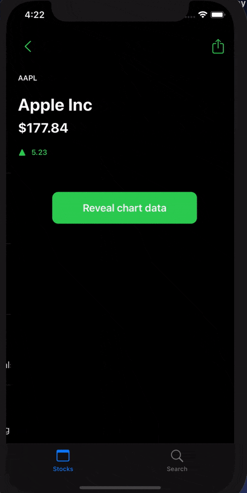

# StockViewer
iOS App: StockViewer: get latest stock info, search stocks, interact with historical stock prices from daily, weekly, and monthly updates.

## Note:
App displays current mock data, but can fetch live data by uncommenting lines in stockview and replacing ForEach blocks with live data instead of mock. Reason is this 
api only allows 5 api calls at a time.  A paid account for the api is needed for full functionality.  Search works as intended, but the detail screen may not update if 5 or more stocks were in results.

## TODO:
sharing, upgrading to a paid account to display all historical stock data instead of only daily data. Refactor. Add unit tests in api, model, and network calls.

** simulator lag and low fps to upload file, not actual performance **

## Built with:
* SwiftUI
* Swift
* Core Data
* MVVM
* Refactoring
